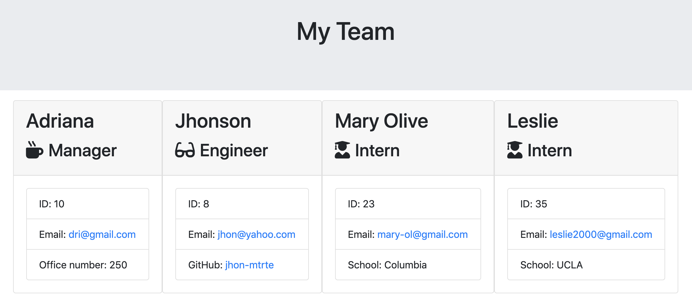
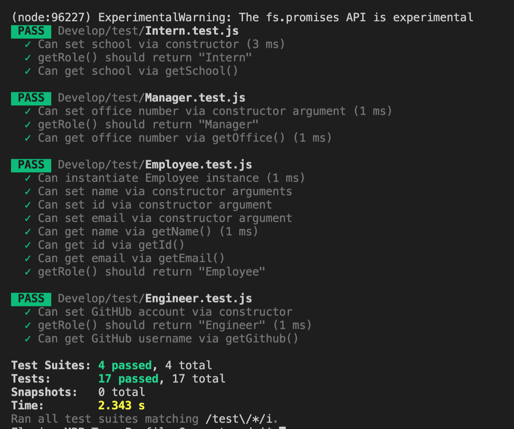

# Team_Profile_Generator

   
  
  
  Check out the badges hosted by [shields.io](https://shields.io/).

#Table of Contents:
  - [Description](#description)
  - [Installation](#installation)
  - [Run](#run)
  - [Test Run](#testRun)
  - [Question](#question) 

## Description 
The application will prompt the user for information about the team manager and then information about the team members. The user can input any number of team members, and they may be a mix of engineers and interns.

## Installation 
`npm install`
`npm install inquirer`
`package.json`

## Run
`node app.js`

## Test Run
There are 4 test files for class validity, known as Software Testing, because it involves the execution of a software component or system component to evaluate one or more properties of interest. In general, these properties indicate the extent to which the component or system under test:

- meets the requirements that guided its design and development,
- responds correctly to all kinds of inputs,
- performs its functions within an acceptable time,
- is sufficiently usable, 

`node run test`

##  Question 
  For more questions about Team Profile Generator you can go to my Github page at the follow link: 

  - [GitHub Profile](https://github.com/adriana-carmo)
  - [GitHub Repo](https://github.com/adriana-carmo/Team_Profile_Generator)

  For additional questions please reach out to my e-mail at : dri.abedala@gmail.com

